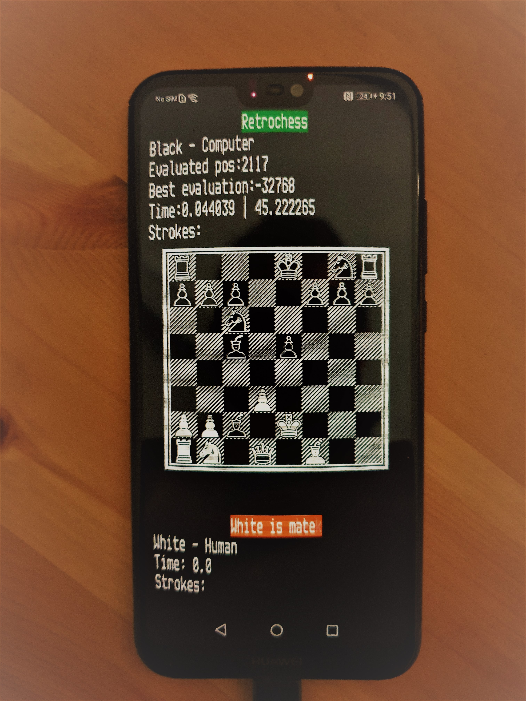

# Retrochess
Play chess against computer in a pure retro style.

Chess Engine coded in C.

IHM made with love2d.

Works on Windows and Android.




# Qu'est ce qu'il nous faut pour qu'un ordinateur joue aux échecs ?
* Un générateur de coups en fonction de l'état de l'échiquier.
* Un algo minimax permettant permettant de construire un arbre des possibilités de jeu entre l'ordinateur et son adversaire.
* Une fonction d'évaluation qui donne la qualité de l'échiquier résultant d'un coup joué.
* Une IHM.

*Le principe :*

Etant l'ordinateur, je cherche à minimiser le coup de mon adversaire, c'est à dire trouver le coup d'évaluation minimale en fonction des réponses de mon adversaire qui seront d'évaluation maximale; 

C'est à dire le min(max) sur une profondeur de 2;

Mais je jouerai mieux si je faisais une recherche sur une profondeur 5 :
```
Appeler MINI_MAX avec 5 et MIN
```

```
Fonction MINI_MAX(profondeur, min_ou_max)
  Si profondeur = 0 -> retourner l'évaluation de l'échiquier

  Si MAX
    Sauvegarder l'échiquier
    Générer les coups possibles pour l'échiquier
      Pour chaque coup
        Jouer le coup
        Appeler récursivement la fonction MINI_MAX avec profondeur - 1 et MIN
        Récupérer l'evaluation du coup joué au retour de la fonction
        Garder l'évaluation MAX
        Restaurer l'échiquier sauvegardé
      Fin Pour
      Retourner l'évaluation MAX

  Si MIN
    Générer les coups possibles pour l'échiquier
      Pour chaque coup
        Jouer le coup
        Appeler récursivement la fonction MINI_MAX avec profondeur - 1 et MAX
        Récupérer l'evaluation du coup joué au retour de la fonction
        Garder l'évaluation MIN
        Restaurer l'échiquier sauvegardé
      Fin Pour
      Retourner l'évaluation MIN
Fin fonction
```

Pour en savoir plus:

* https://fr.wikipedia.org/wiki/Programming_a_Computer_for_Playing_Chess
* https://fr.wikipedia.org/wiki/Algorithme_minimax
* [ProgrammingaComputerforPlayingChess.pdf](./ProgrammingaComputerforPlayingChess.pdf) 


# Dépendances
* Le moteur est développé en C.
* Il utilise un générateur de coups de type ["BitBoard"](https://github.com/pioz/chess), autrement dit les échiquiers sont codés sur 64 bits et les calculs des trajectoires de pièces se font avec des opérateurs bit à bit. (https://www.chessprogramming.org/Bitboards).
* Concernant le stockage en mémoire, des [Containers](https://github.com/bkthomps/Containers).
* L'interface est développée en [Lua](https://www.lua.org/) avec [Löve2D](https://love2d.org/), un framework 2D, qui facilite le portage entre différentes machines.
* Le look console provient de [LV100](https://github.com/Eiyeron/LV-100). 
* Le style retro provient de [moonshine](https://github.com/vrld/moonshine), une api permettant de créer des effets avec des shaders GLSL en lua.

# Architecture du projet
Le projet se compose :
* du "moteur" en C qui prend la forme d'une librairie .dll sous Windows et .so sous Android. Le code et le Makefile [MSYS2](https://www.msys2.org/docs/environments/) se trouvent dans le sous répertoire bitboard ; le make est à lancer en mode MINGW64 pour ne pas avoir de dépendance vers cygwin mais vers msvcrt. Pour construire la librairie Android, les fichiers Android.mk et Application.mk sont présents mais il est nécessaire d'installer le [NDK](https://developer.android.com/ndk) Android au préalable.
* de l'interface en lua dans le sous répertoire assets. Le point d'entrée est le fichier main.lua. Il est nécessaire d'adapter le chemin vers la dll windows dans ce source (variable sharedPath dans la fonction get_funcs()). Pour lancer le main.lua, il faut avoir installer Löve2d. On dispose alors de l'interpreteur love.exe qui prend le répertoire assets en paramètre : ``` love assets ```. Concernant la librairie partagée Android, elle est directement insérée dans le source main.lua en base64. Au démarrage de l'apk, si le système est android, le .so est recréé et copié dans un répertoire utilisateur. Le chargement dynamique de la librairie est fait juste après.
* d'un script powershell permettant de créer l'apk Android. Il utilise pour cela [l'apk de base love2d](https://github.com/love2d/love/releases/download/11.3/love-11.3-android.apk). L'apk est d'abord décompressé dans un répertoire, le code lua du jeu d'échec y est copié. Le répertoire est ensuite recompressé et signé avec les outils présents dans le répertoire tools. Pour cela, le jdk java doit être présent sur la machine. 

# Ajout d'une interface 3D


Le code (en cours de développement) se trouve dans le sous répertoire win32.
Cette interface permet de mettre en oeuvre OpenGL à travers [glfw](https://www.glfw.org/).
